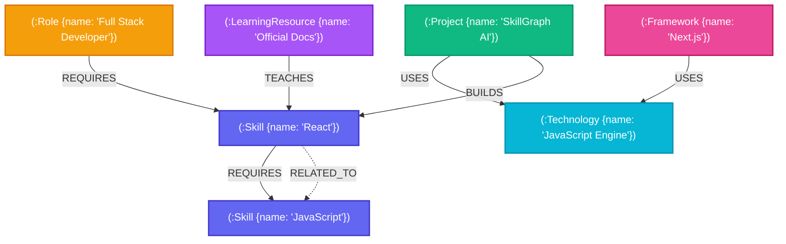

# ⚡ SkillGraph AI

> Production-quality, graph database-powered Skill Discovery & Career Learning Roadmap Platform built for **CognoDB Cloud** using React, TypeScript, Vite, Tailwind CSS, Node.js, Express, and openCypher queries (via official Neo4j JS driver compatibility layer).

---

## 📸 Screenshots Showcase

### 1. Hero Landing Page & Live Graph Preview

*Hero section featuring CognoDB Cloud branding, live interactive graph centerpiece, 5-step workflow overview, and quick skill search.*

### 2. Interactive Cytoscape.js Graph Explorer

*Fullscreen interactive graph visualizer with layout controls (`cose`, `concentric`, `circle`), zoom/pan, node inspector, and 3-hop traversal highlights.*

### 3. Skill Graph Roadmap Studio

*Searchable multi-select skill picker, career readiness score calculation, missing skills timeline, and quick-win project recommendations.*

### 4. Career Roles Match Ranking

*Ranked career opportunities displaying skill match percentages, required skills, missing prerequisites, and market salaries.*

---

## 🌟 Project Overview

**SkillGraph AI** demonstrates why **Graph Databases** outperform traditional Relational Databases (RDBMS) when modeling highly connected data networks like skills, prerequisites, software frameworks, technology stacks, practice projects, and career role requirements.

Instead of performing expensive multi-table recursive SQL `JOIN`s, SkillGraph AI utilizes **CognoDB Cloud openCypher pattern matching** to compute sub-millisecond multi-hop learning roadmaps, career readiness percentages, shortest skill learning paths, and project recommendations tailored to developer skill sets.

---

## ✨ Key Features

- **🧠 Interactive Roadmap Studio**: Select your known skills and target career goal to generate a step-by-step ordered learning timeline.
- **🕸️ Centerpiece Cytoscape.js Explorer**: Real-time interactive graph canvas supporting zoom, pan, physics layout switching (cose, concentric, circle, breadthfirst), node inspection, and hop highlight traversals.
- **📍 Shortest Skill Path Calculator**: Compute exact multi-hop learning routes between any two skills (e.g. `React` → `LangChain`).
- **⚡ Quick Demo Presets**: One-click preset scenarios for MERN Full Stack, AI & LLM Engineer, and DevOps & Cloud Specialist.
- **📊 Career Readiness & Skill Match %**: Computes precise percentage match against 20+ real-world industry roles.
- **🚀 Recommended Practice Projects**: Suggests project ideas from a library of 40+ projects, featuring special *"Quick Win"* badges for projects requiring only 1 missing skill.
- **📚 Curated Resources Library**: Matches missing skills to 40+ courses, interactive sandboxes, and documentation.
- **📄 Native PDF Export**: Download your personalized learning roadmap directly as a styled PDF document.
- **🛡️ 100% Parameterized Cypher**: Secure query execution with zero string concatenation.

---

## 🏗️ Architecture

```
                                  +-----------------------+
                                  |   React + Vite Client |
                                  | (Cytoscape, Tailwind) |
                                  +-----------+-----------+
                                              |
                                       REST / JSON API
                                              |
                                  +-----------v-----------+
                                  | Node.js Express Server|
                                  | (TypeScript, Zod API) |
                                  +-----------+-----------+
                                              |
                                  openCypher / Neo4j Driver
                                              |
                                  +-----------v-----------+
                                  |  CognoDB Cloud Engine |
                                  |  (Graph Cypher Engine)|
                                  +-----------------------+
```

---

## 📁 Folder Structure

```
SkillGraph-AI/
├── server/                         # Express + Node.js TypeScript Backend
│   ├── package.json
│   ├── tsconfig.json
│   ├── .env.example
│   └── src/
│       ├── config/                 # Env validation (COGNODB_URI, COGNODB_USERNAME, COGNODB_PASSWORD)
│       │   └── env.ts
│       ├── db/                     # CognoDB Driver & Seed Dataset (80+ skills, 30+ tech, 20+ roles, 40+ projects)
│       │   ├── neo4j.ts
│       │   └── seedData.ts
│       ├── types/                  # Shared TypeScript models
│       │   └── index.ts
│       ├── utils/                  # Parameterized openCypher queries
│       │   └── cypherQueries.ts
│       ├── services/               # Graph traversal business logic
│       │   └── graphService.ts
│       ├── controllers/            # Express endpoint handlers
│       │   └── graphController.ts
│       ├── routes/                 # API router (/skills, /recommend, /roadmap, etc.)
│       │   └── api.ts
│       ├── scripts/                # Database seed script with schema indexes & constraints
│       │   └── seed.ts
│       └── app.ts                  # Server entry point
│
└── client/                         # React + TypeScript + Vite + Tailwind CSS Frontend
    ├── package.json
    ├── vite.config.ts
    ├── tailwind.config.js
    ├── index.html
    └── src/
        ├── api/                    # Axios API client wrapper
        │   └── client.ts
        ├── components/
        │   ├── graph/              # Cytoscape.js canvas visualizer & node inspector
        │   │   └── CytoscapeGraph.tsx
        │   ├── layout/             # Navbar, Sidebar, Footer
        │   ├── project/            # ProjectCard component
        │   ├── roadmap/            # RoadmapTimeline step visualizer
        │   ├── role/               # RoleCard with match % indicator
        │   └── ui/                 # Badge, Skeleton loaders
        ├── pages/
        │   ├── HomePage.tsx        # Hero landing view with live graph preview & 5-step workflow
        │   ├── DashboardPage.tsx   # Multi-select skill picker & Roadmap studio
        │   ├── GraphExplorerPage.tsx # Fullscreen Cytoscape graph explorer & 3-hop query
        │   ├── RoadmapPage.tsx     # Timeline view
        │   ├── RolesPage.tsx       # 20+ career roles catalog
        │   ├── ProjectsPage.tsx    # 40+ projects library
        │   └── ResourcesPage.tsx   # 40+ learning resources catalog
        ├── utils/                  # PDF export helper
        ├── App.tsx                 # React Router setup with React.lazy code splitting
        └── main.tsx                # Client entry point
```

---

## 🌐 Graph Data Model (Mermaid Diagram)



---

## 🤔 Why Graph Database Over Relational DB?

| Feature | Relational Database (RDBMS) | Graph Database (CognoDB Cloud) |
| :--- | :--- | :--- |
| **Prerequisite Path Traversal** | Requires expensive N-level recursive SQL `JOIN` queries. | Sub-millisecond openCypher `shortestPath` pattern matching. |
| **Performance with Depth** | Degrades exponentially ($O(N^k)$) as relationship hops increase. | Constant time $O(1)$ index-free adjacency traversals. |
| **Connected Data Flexibility** | Strict tabular schemas require rigid junction mapping tables. | Native graph nodes (`:Skill`) and labeled relationships (`:REQUIRES`). |
| **Cypher Query Expressiveness** | Complex 50-line SQL statement. | Declarative 4-line openCypher query. |

---

## 🔍 Required openCypher Queries (100% Parameterized)

### 1. Find missing skills for a selected role
```cypher
MATCH (r:Role {id: $roleId})-[:REQUIRES]->(s:Skill)
WHERE NOT s.id IN $knownSkillIds
OPTIONAL MATCH (s)-[:REQUIRES]->(prereq:Skill)
RETURN s AS missingSkill, collect(DISTINCT prereq) AS prerequisites
```

### 2. Recommend projects based on known skills
```cypher
MATCH (p:Project)-[:BUILDS]->(s:Skill)
OPTIONAL MATCH (p)-[:USES]->(t:Technology)
OPTIONAL MATCH (p)-[:REQUIRES_SKILL]->(req:Skill)
WITH p, collect(DISTINCT s) AS skillsLearned, collect(DISTINCT t) AS techStack, collect(DISTINCT req.id) AS reqSkillIds
WITH p, skillsLearned, techStack, [id IN reqSkillIds WHERE NOT id IN $knownSkillIds] AS missingReqs
RETURN p AS project, skillsLearned, techStack, missingReqs
ORDER BY size(missingReqs) ASC
```

### 3. Find shortest learning path from one skill to another
```cypher
MATCH (start:Skill {id: $startSkillId}), (target:Skill {id: $targetSkillId})
MATCH path = shortestPath((start)-[:REQUIRES|RELATED_TO*..6]->(target))
RETURN [node IN nodes(path) | node] AS pathNodes
```

### 4. Find related technologies
```cypher
MATCH (s:Skill {id: $skillId})
OPTIONAL MATCH (p:Project)-[:BUILDS]->(s)
OPTIONAL MATCH (p)-[:USES]->(t:Technology)
RETURN DISTINCT t AS technology
```

### 5. Find all skills within 3 hops
```cypher
MATCH (s:Skill {id: $skillId})
MATCH path = (s)-[:RELATED_TO|REQUIRES*1..3]-(connected:Skill)
WITH connected, min(length(path)) AS hops
RETURN connected AS skill, hops ORDER BY hops ASC
```

### 6. Recommend learning resources
```cypher
MATCH (lr:LearningResource)-[:TEACHES]->(s:Skill)
WHERE s.id IN $missingSkillIds
RETURN lr AS resource, s AS taughtSkill
```

### 7. Find roles matching current skills with Match %
```cypher
MATCH (r:Role)-[:REQUIRES]->(s:Skill)
WITH r, collect(DISTINCT s.id) AS requiredSkillIds
WITH r, requiredSkillIds,
     [id IN requiredSkillIds WHERE id IN $knownSkillIds] AS matchedSkillIds,
     [id IN requiredSkillIds WHERE NOT id IN $knownSkillIds] AS missingSkillIds
WITH r, requiredSkillIds, matchedSkillIds, missingSkillIds,
     round((toFloat(size(matchedSkillIds)) / toFloat(size(requiredSkillIds))) * 100) AS matchPercentage
RETURN r AS role, matchPercentage ORDER BY matchPercentage DESC
```

### 8. Find projects requiring only one missing skill
```cypher
MATCH (p:Project)-[:BUILDS]->(s:Skill)
WITH p, collect(DISTINCT s.id) AS neededSkillIds
WITH p, [id IN neededSkillIds WHERE NOT id IN $knownSkillIds] AS missing
WHERE size(missing) = 1
RETURN p AS project, missing[0] AS singleMissingSkillId
```

---

## 🛠️ Installation & Setup Guide

### 1. Install Dependencies
```bash
npm run setup
```

### 2. Environment Variables (`.env`)
```env
PORT=5000
NODE_ENV=development
CLIENT_URL=http://localhost:5173

# CognoDB Cloud Credentials
COGNODB_URI=bolt://localhost:7687
COGNODB_USERNAME=cognodb_user
COGNODB_PASSWORD=cognodb_password
```

### 3. Seed CognoDB Database
```bash
npm run seed
```

### 4. Start Development Servers
```bash
# Backend (port 5000)
cd server && npm run dev

# Frontend (port 5173)
cd client && npm run dev
```

---

## 🚀 Deployment Instructions

### Frontend (Vercel)
- Set Framework Preset: Vite
- Root Directory: `client`
- Environment Variable: `VITE_API_URL=https://your-backend.onrender.com/api`

### Backend (Render)
- Root Directory: `server`
- Build Command: `npm run build`
- Start Command: `npm start`
- Environment Variables: `COGNODB_URI`, `COGNODB_USERNAME`, `COGNODB_PASSWORD`
