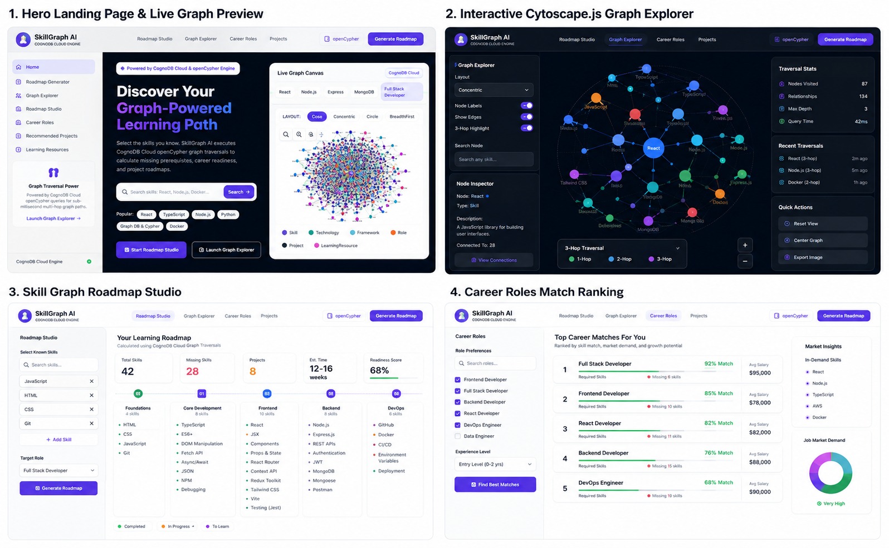

# ⚡ SkillGraph AI

[](https://skillgraph-ai-ashen.vercel.app)
[](https://github.com/ayushmanji/skillgraph-AI)

> 🚀 **Live Production Application**: **[https://skillgraph-ai-ashen.vercel.app](https://skillgraph-ai-ashen.vercel.app)**
>
> Production-quality, graph database-powered Skill Discovery & Career Learning Roadmap Platform built for **CognoDB Cloud** using React, TypeScript, Vite, Tailwind CSS, Node.js, Express, and openCypher queries (via official Neo4j JS driver compatibility layer).

---

## 🌐 Live Production Demo & GitHub Repository

- 🔗 **Live Hosted App**: [https://skillgraph-ai-ashen.vercel.app](https://skillgraph-ai-ashen.vercel.app)
- 📁 **GitHub Source Code**: [https://github.com/ayushmanji/skillgraph-AI.git](https://github.com/ayushmanji/skillgraph-AI.git)

---

## 📸 4-Section Platform Showcase



*Complete 4-Module Overview: 1. Roadmap Studio, 2. Interactive Cytoscape Graph Visualizer, 3. Career Roles Match Ranking, and 4. Recommended Projects & Learning Resources.*

---

## 🌟 Project Overview

**SkillGraph AI** demonstrates why **Graph Databases** outperform traditional Relational Databases (RDBMS) when modeling highly connected data networks like skills, prerequisites, software frameworks, technology stacks, practice projects, and career role requirements.

Instead of performing expensive multi-table recursive SQL `JOIN`s, SkillGraph AI utilizes **CognoDB Cloud openCypher pattern matching** to compute sub-millisecond multi-hop learning roadmaps, career readiness percentages, shortest skill learning paths, and project recommendations tailored to developer skill sets.

---

## ✨ Key Features

- **🧠 Interactive Roadmap Studio**: Select your known skills and target career goal to generate a step-by-step ordered learning timeline.
- **🕸️ Centerpiece Cytoscape.js Explorer**: Real-time interactive graph canvas supporting zoom, pan, physics layout switching (cose, concentric, circle, breadthfirst), node inspection, and hop highlight traversals.
- **📍 Shortest Skill Path Calculator**: Compute exact multi-hop learning routes between any two skills (e.g. `React` → `LangChain`).
- **⚡ Quick Demo Presets**: One-click preset scenarios for MERN Full Stack, AI & LLM Engineer, and DevOps & Cloud Specialist.
- **📊 Career Readiness & Skill Match %**: Computes precise percentage match against 20+ real-world industry roles.
- **🚀 Recommended Practice Projects**: Suggests project ideas from a library of 40+ projects, featuring special *"Quick Win"* badges for projects requiring only 1 missing skill.
- **📚 Curated Resources Library**: Matches missing skills to 40+ courses, interactive sandboxes, and documentation.
- **📄 Native PDF Export**: Download your personalized learning roadmap directly as a styled PDF document.
- **🛡️ 100% Parameterized Cypher**: Secure query execution with zero string concatenation.

---

## 🏗️ Architecture

```
                                  +-----------------------+
                                  |   React + Vite Client |
                                  | (Cytoscape, Tailwind) |
                                  +-----------+-----------+
                                              |
                                       REST / JSON API
                                              |
                                  +-----------v-----------+
                                  | Node.js Express Server|
                                  +-----------+-----------+
                                              |
                                    openCypher (Neo4j Driver)
                                              |
                                  +-----------v-----------+
                                  |     CognoDB Cloud     |
                                  |  (Graph Engine DB)    |
                                  +-----------------------+
```

---

## 💻 Tech Stack

| Layer | Technology |
| :--- | :--- |
| **Database** | **CognoDB Cloud** (openCypher / Neo4j JS Driver Protocol Compatible) |
| **Backend** | Node.js, Express, TypeScript, Zod |
| **Frontend** | React 18, TypeScript, Vite, Tailwind CSS, TanStack Query, Framer Motion |
| **Graph Visualizer**| **Cytoscape.js** |
| **PDF Generation** | HTML2Canvas + jsPDF |

---

## 🚦 Quick Start Guide

### Prerequisites
- **Node.js**: v18.0.0 or higher
- **npm**: v9.0.0 or higher
- **CognoDB Cloud Instance** (or local instance)

### 1. Clone & Setup
```bash
git clone https://github.com/ayushmanji/skillgraph-AI.git
cd skillgraph-AI
npm run setup
```

### 2. Configure Environment Variables
Copy `.env.example` in `server/`:
```bash
cp server/.env.example server/.env
```
Fill in your CognoDB credentials:
```env
PORT=5000
NODE_ENV=development
CLIENT_URL=http://localhost:5173
COGNODB_URI=bolt://localhost:7687
COGNODB_USERNAME=neo4j
COGNODB_PASSWORD=your_password
```

### 3. Run In-Memory Seed & Index Script
```bash
cd server
npm run seed
```

### 4. Start Development Servers
```bash
npm run dev
```
- **Frontend App**: `http://localhost:5173`
- **Backend Server**: `http://localhost:5000/api`

---

## 🚀 Production Build & Deployment

```bash
npm run build
```

This compiles both TypeScript server (`server/dist`) and Vite client bundle (`client/dist`).

---

## 📄 License

MIT License © 2026 SkillGraph AI
